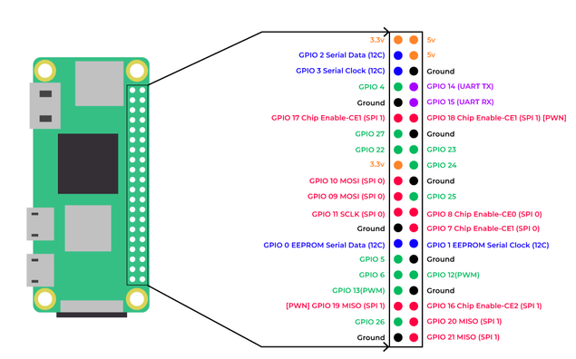

# GRPC ROBOT

This repository holds the code to control a robot via Raspberry Pi conencted to [L293D Motor Driver board](https://www.bitsandparts.nl/Motor-driver-shield-L293D-voor-Arduino-p1294453?gad_source=1&gad_campaignid=17339301268&gbraid=0AAAAADpItpe3HA-clnBiX8p_uRYhw_wBe&gclid=CjwKCAiA3fnJBhAgEiwAyqmY5cFdRNIMlOnbJqGxeIFqAuiL7uQ5hB8fv5S6RmijscX49ZbtQKkHcRoCglAQAvD_BwE) (See [Schematics](https://www.openimpulse.com/blog/wp-content/uploads/wpsc/downloadables/Motor-Shield-V12-Schematic-Diagram.png)).
A gRPC server is listening to requests to move the robot.

The Selected GPIO to control the shift registers are hardcoded.


```python
DATA_PIN = 17  # Serial Data Input (DS) -> IDUINO PIN D8
CLOCK_PIN = 27  # Shift Register Clock (SHCP) -> IDUINO PIN D4
LATCH_PIN = 22  # Storage Register Clock / Latch (STCP) -> IDUINO PIN D12
OUTPUT_ENABLE_PIN = 23  # Output Enable (OE) -> IDUINO PIN D7 (active LOW)
```

Pins `PWM2A, PWM2B, PWM0A, PWM0B` are connected to 5V. The entire circuit including motors can be powered by 5V. 



## Generate the proto files
`uv run python -m grpc_tools.protoc -Iproto_gen=proto --python_out=. --pyi_out=. --grpc_python_out=. proto/control.proto`

## Lint 

`uv run ruff check .`

## Format

`uv run black .`

## Run

`uv run python -m app.server`

`uv run python -m app.client`

## Docker

`docker run --device /dev/gpiomem -p 50051:50051 <tag>`
